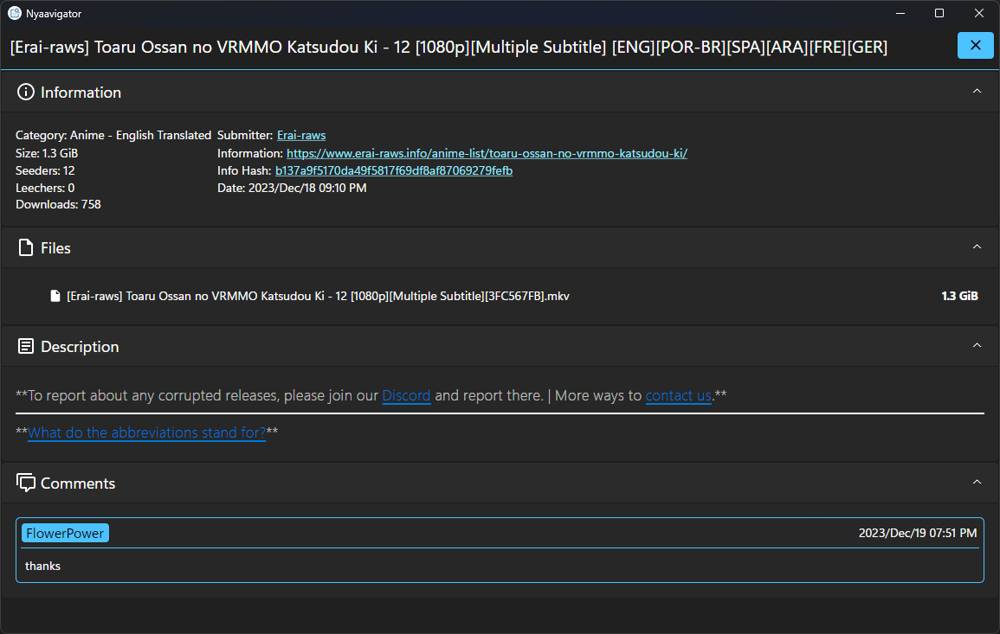

 

  

  <h3 align="center">Nyaavigator</h3>

  

    An app for browsing <a href="https://www.nyaa.si">nyaa.si</a>.
     
     
    <a href="https://github.com/FawazTakhji/Nyaavigator/issues/new?labels=bug&template=bug_report.md">Report Bug</a>
    .
    <a href="https://github.com/FawazTakhji/Nyaavigator/issues/new?labels=enhancement&template=feature_request.md">Request Feature</a>
  

  

## Usage
Go to the
<a href="https://github.com/FawazTakhji/Nyaavigator/releases">releases</a>
page and download the correct version for your operating system.

### Windows
#### Installation
Download `Nyaavigator_VERSION_Installer.exe` and follow the setup wizard.

#### Portable
Download `Nyaavigator_VERSION_Windows_Portable.zip` and extract it anywhere, app files will be stored in the same directory as `Nyaavigator.exe` so you should extract the app to somewhere that doesn't require administrator permissions.

### Linux
#### Normal
Download `Nyaavigator_VERSION_Linux.tar.gz` and extract it anywhere, app files will be stored in `/etc/nyaavigator` so you will have to make the directory and set the correct permissions.

#### Portable
Download `Nyaavigator_VERSION_Linux_Portable.tar.gz` and extract it anywhere, app files will be stored in the same directory as the `Nyaavigator` executable so you should set the correct permissions for the directory.

#### Deb Package
Download `Nyaavigator_VERSION.deb`, then open your terminal in the directory that the file is in and enter the following command `sudo dpkg -i Nyaavigator_VERSION.deb`.
 
You use the same command to install an update.
 
To delete the package you enter the following command `sudo apt remove nyaavigator`.

## Acknowledgements

* [AsyncAwaitBestPractices](https://github.com/brminnick/AsyncAwaitBestPractices)
* [Avalonia](https://github.com/AvaloniaUI/Avalonia)
* [CommunityToolkit.Mvvm](https://github.com/CommunityToolkit/dotnet)
* [FluentAvalonia](https://github.com/amwx/FluentAvalonia)
* [Html Agility Pack](https://github.com/zzzprojects/html-agility-pack)
* [Markdown.Avalonia](https://github.com/whistyun/Markdown.Avalonia)
* [Material.Icons](https://github.com/SKProCH/Material.Icons)
* [NLog](https://github.com/NLog/NLog)
* [Pictogrammers](https://pictogrammers.com)

## Screenshots

